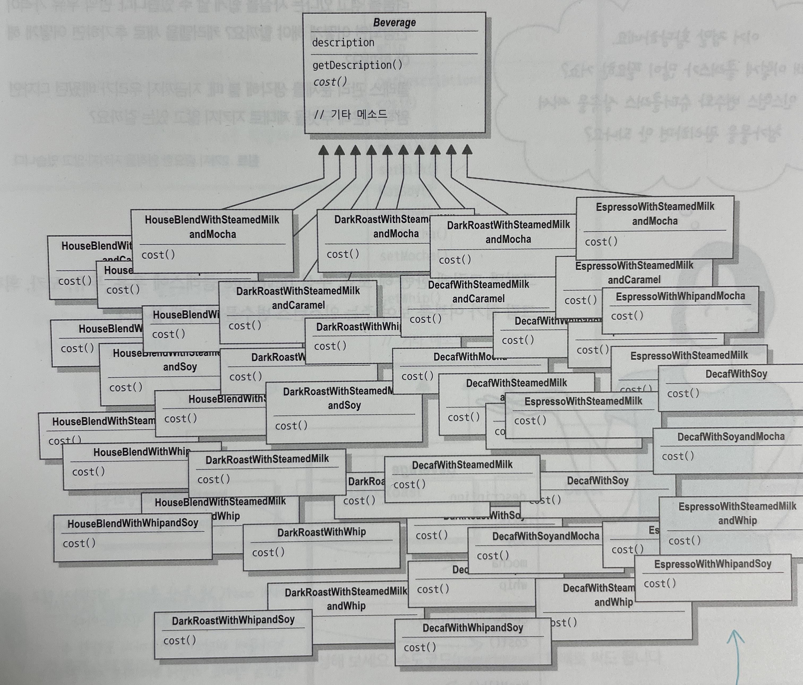

## 데코레이터 패턴

데코레이터 패턴은 기존 클래스 코드를 바꾸지 않고 객체에 새로운 임무를 추가할 수 있습니다.

### 커피숍

어떤 커피숍의 주문 시스템 클래스가 아래와 같이 구성되어 있습니다.

```js
class Beverage {
  cost()
}

class HouseBlend extends Beverage  { cost() }
class DarkRoast extends Beverage  { cost() }
class Decaf extends Beverage  { cost() }
class Espresso extends Beverage  { cost() }
```

시작한지 얼마 안된 커피숍이기때문에 메뉴가 많지 않습니다. 그러나 점점 손님이 늘어나면서 고객의 요구사항이 점점 많아지고 우유, 두유, 모카 등을 추가하거나 휘핑크림을 얹기도 합니다. 이때마다 커피메뉴는 동일하지만 커피의 가격은 변동되어야 합니다. 이러한 것들을 고려하면 아래와 같은 상황이 생깁니다.

```js
class HouseBlendWithSteamedMilkandMocha extends Beverage {}
class DarkRoastWithSteamedMilkandCaramel extends Beverage {}
....
....
....
```



만약 상속으로 이를 구현하려고 한다면 매번 새로운 옵션이 추가될때마다 수퍼클래스와 서브클래스의 코드가 변경되어야 합니다. 이러한 문제를 데코레이터 패턴을 활용하여 OCP 원칙을 준수할 수 있습니다.

> OCP (Open-Closed Principle) 클래스는 확장에는 열려있어야 하지만 변경에는 닫혀 있어야 한다.
